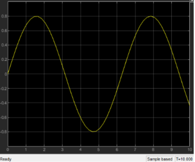

# Car_Suspention_System_Modeling
Car suspension system modeling and oscillation analysis using Simulink.

The damper in the car suspension model is as below:

The differential equation corresponding to this model:

The transfer function can be modeled using simulink blocks as below:

The **impulse response** of the system when B = 0 (no suspension):

As it can be seen, the result is a sine wave. 

Modeling the system with the smallest value of B which makes the poles real numbers:

By doing the calculations, we can see that min B = 2. The output to this value:

As it can be seen, the value converges to 0 for larger values of t, which means that the turbulances in the car are being controlled.

The output of the system for large values of B:

As it can be seen, the output converges to 0 much faster, so this is the best case for our model.

